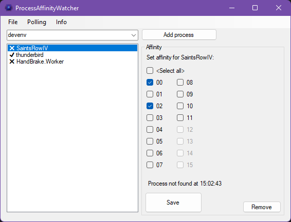

# ProcessAffinityWatcher

This was born out of the need to manage processor affinity after the processes already started.

In my case of Saints Row IV the affinity would be overwritten by Steam when you use the `start /affinity 5` thingy.

Anyway, other solutions like WinAFC or Prio are way out of date or didn't provide me with a nice solution.

### Download
» [Download executeable under Releases](https://github.com/PakL/ProcessAffinityWatcher/releases)

Tested under Windows 11, but should work fine under Windows 10. Requires [.NET Framework 4.8 Runtime](https://dotnet.microsoft.com/en-us/download/dotnet-framework/net48). Runs portable, without installation.

**UAC will ask for administrator permission because that is required to set process affinity.**

